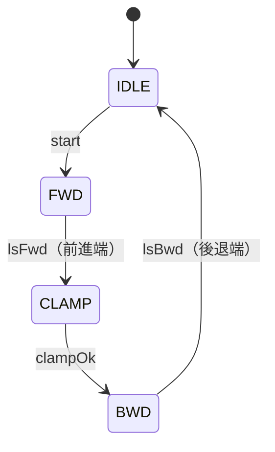

# ラダー → ST 変換を、ラダーを知らないSEのために解説する

> 触って理解したい人向けのシミュレータ: [ladder-to-st-simulator.html](./ladder-to-st-simulator.html)
> （ブラウザで開くと、ラダーが1スキャンずつ動く様子と、ST 2種類との対応が見えます）

「RD → ST」と書いていた変換は、正式には **LD（Ladder Diagram, ラダー図）→ ST（Structured Text）** です。
このメモでは「ラダー」と呼びます。

---

## 0. 結論を先に

- **ラダーをそのまま ST に直すのは簡単。でも、それだけでは嬉しくない。**
  出てくるのは「テキストになったラダー」で、読みやすさは変わらない（むしろ絵がなくなるので下がる）。
- **嬉しいのは「ST らしく書き直す」こと。でも、ここに工数がかかる。**
  工数の正体は「書き換え作業」ではなく、**ラダーのどこにも書かれていない「今どの工程か」を掘り起こす作業**。
- つまり 2 つの変換は「同じ作業の丁寧さの差」ではなく、**別の成果物**。
  前者はコードの表記変換、後者は仕様を復元してから書き直すリバースエンジニアリング。

以下、この結論に必要な知識を、ゼロから順に積み上げます。

---

## 1. PLC は「ぐるぐる回る while ループ」

PLC は工場の機械を動かす小さなコンピュータです。中身のプログラムは、SE の言葉にするとこれだけです。

```c
while (true) {
  入力を読む();          // センサやボタンの ON/OFF をメモリにコピー
  プログラムを上から下まで実行();
  出力を書く();          // メモリの値をモータやランプに出す
}
```

この 1 周を **スキャン** と呼びます。1 周は数ミリ秒。1 秒に何百回も回ります。


大事なポイントが 1 つ。**ラダーも ST も、この同じループの中で動きます。**
ST にしたからイベントドリブンになるわけではないし、軽くなるわけでもありません。
言語が違うだけで、実行モデルは同じです。

---

## 2. ラダーの読み方（SE 向け翻訳）

ラダーは「電気回路図の見た目で書くプログラム言語」です。
左右に縦線（電源のイメージ）があって、横に 1 本ずつ **ラング（段）** を書きます。

```
  |    X0        Y0
  |----| |------( )----|
```

これは「X0 が ON なら Y0 を ON にする」。SE 向けに翻訳するとこうなります。

| ラダーの部品 | 見た目 | SE 的な意味 |
|---|---|---|
| a 接点 | `--| |--` | 変数を読む（そのまま） |
| b 接点 | `--|/|--` | 変数を読む（NOT） |
| 直列につなぐ | `--| |--| |--` | AND |
| 並列につなぐ | 上下に枝分かれ | OR |
| コイル | `--( )--` | 変数に **代入** する |

つまり **1 ラング = 1 つの `bool 変数 := 式;`** です。上のラングは `Y0 := X0;` と同じ。

変数名は `X0`（入力）、`Y0`（出力）、`M100`（内部メモリ）、`D100`（数値）のように、種類 + 番号で書きます。三菱の流儀です。

---

## 3. 自己保持 = 「ボタンを離しても覚えている」回路

ラダーの一番大事な基本パターンです。

```
  |    X0(起動)          X1(停止)     M100(運転中)
  |----| |--------+--------|/|----------( )----|
  |    M100       |
  |----| |--------+
```

読み方：
- X0（起動ボタン）を押すと M100 が ON になる
- M100 自身が並列（OR）に入っているので、**X0 を離しても M100 は ON のまま**
- X1（停止ボタン）を押すと、b 接点（NOT）で切れて M100 が OFF になる

ST に直訳すると 1 行です。

```iecst
M100 := (X0 OR M100) AND NOT X1;
```

SE 的に言えば、**自分の出力を自分の入力に戻している 1 ビットのメモリ**（SR フリップフロップ）です。
右辺の `M100` は「前のスキャンで代入した値」を読んでいるので、覚えていられます。

---

## 4. 工程（ステップ）は、自己保持を鎖のようにつないで作る

機械の動きは「前進 → クランプ → 後退」のように順番があります。
ラダーではこれを、**自己保持リレーを鎖のようにつないで**書きます（工程歩進と呼ばれます）。

例：シリンダでワークを押し出す 3 工程。

| 工程 | やること | 次へ進む条件 |
|---|---|---|
| 1. 前進 | 前進ソレノイド Y0 を ON | 前進端センサ X2 が ON |
| 2. クランプ | クランプ Y2 を ON | クランプ確認 X4 が ON |
| 3. 後退 | 後退ソレノイド Y1 を ON | 後退端センサ X3 が ON |

ラダー（M101 = 工程 1 中、M102 = 工程 2 中、M103 = 工程 3 中）：

```
  |   X0(起動)               M102      M103
  |----| |-------+-----------|/|-------|/|------( M101 )---|   工程1: 起動で立ち上がり、工程2が始まったら消える
  |   M101       |                                            （他の工程中は起動を受け付けない）
  |----| |-------+

  |   M101   X2(前進端)        M103
  |----| |----| |----+--------|/|-------( M102 )---|   工程2: 工程1中に前進端に着いたら立ち上がる
  |   M102            |
  |----| |------------+

  |   M102   X4(クランプ確認)   X3(後退端)
  |----| |----| |----+--------|/|-------( M103 )---|   工程3: 後退端に戻ったら消える
  |   M103            |
  |----| |------------+

  |   M101                 Y0(前進SOL)
  |----| |------------------( )---|
  |   M102                 Y2(クランプ)
  |----| |------------------( )---|
  |   M103                 Y1(後退SOL)
  |----| |------------------( )---|
```

ここで **一番大事なこと** に気づいてください。

> **「今、工程 2 にいる」という情報を持っている変数が、どこにもない。**

工程 2 にいることは「M101 = OFF、M102 = ON、M103 = OFF」という **複数ビットの組み合わせ** で表されています。
人がモニタ画面を見て、光っている接点の組み合わせから「あ、今は工程 2 だ」と読み取ります。
状態が **暗黙的に、複数の変数に分散して** 存在しているのです。

---

## 5. 変換その 1：「そのまま変換」（直訳）

全ラングを式に書き下すだけです。

```iecst
M101 := (X0 OR M101) AND NOT M102 AND NOT M103;
M102 := ((M101 AND X2) OR M102) AND NOT M103;
M103 := ((M102 AND X4) OR M103) AND NOT X3;
Y0 := M101;
Y2 := M102;
Y1 := M103;
```

- **簡単。** ルールが決まっているので、プログラムで自動生成できる
- **正しい。** ラングの順番どおりに書けば、動きも完全に同じ
- **でも読みにくい。** 「今どの工程？」は依然としてどこにも書かれていない。自己保持の鎖も、散らばった SET/RST も、そのまま残る
- ラダーの絵なら「どの接点がコイルを止めているか」が図で見えたのに、式に埋もれて見えなくなる

得られるのは **Git で管理できる、diff が見られる、テキスト検索できる** というインフラの恩恵だけです。
それが目的なら、これで十分です。

---

## 6. 変換その 2：「ST らしく書き直す」

暗黙だった「今どの工程か」を、**名前のついた 1 つの変数** にします。

```iecst
TYPE E_Step : (IDLE, FWD, CLAMP, BWD); END_TYPE

CASE step OF
  IDLE:   (* 待機 *)
    IF start THEN step := FWD; END_IF

  FWD:    (* 前進 *)
    solFwd := TRUE;
    IF lsFwd THEN solFwd := FALSE; step := CLAMP; END_IF

  CLAMP:  (* クランプ *)
    clamp := TRUE;
    IF clampOk THEN step := BWD; END_IF

  BWD:    (* 後退 *)
    clamp := FALSE;
    solBwd := TRUE;
    IF lsBwd THEN solBwd := FALSE; step := IDLE; END_IF
END_CASE
```



何が嬉しいか：

- `step` を見れば **今どこにいるか一発で分かる**。HMI（タッチパネル）にそのまま「前進中」と出せる
- 工程ごとのコードが **ひとまとまり** になる。遷移は `step := CLAMP;` という **明示的な代入** になる
- 機構ごとに FB（ファンクションブロック。クラスのようなもの）に切れば、**別の装置で使い回せる**
- 構造が決まっているので、**仕様書と対応が取れる**し、**AI に生成させたり検図ルールを書いたりできる**

SE の言葉にすると、**goto だらけのコードを、状態機械とクラスに整理するリファクタリング**です。
ただし元のコードに設計意図が書かれていないので、実態は **仕様を復元するリバースエンジニアリング** です。

---

## 7. なぜ変換その 2 は難しいのか（3 つの理由）

### 理由 1：状態が暗黙的に分散している

4 章のとおり、「どのビットの組み合わせが工程を表しているのか」を **見つけ出す** 必要があります。
排他的に ON になるビット群を探す作業で、静的解析だけでは決まらず、実機のログで「同時に ON にならない組」を確かめることになります。
SE の比喩なら、**機械語を構造化された C に逆コンパイルするときの、制御フロー復元と同じ問題** です。

### 理由 2：ラングの順番と「1 スキャン遅れ」に意味がある

スキャンは上から下に実行されます。だから：

- ラング 10 でコイルを書き、ラング 11 で読む → **今のスキャン** の値
- ラング 10 でコイルを書き、ラング 5 で読む → **前のスキャン** の値（1 スキャン遅れ）

設計者はこの遅れや、「リセット優先 / セット優先」の書き方を **意図的に** 使っています。
CASE 文にまとめ直すと実行される順番が変わり、タイミングが 1 スキャンずれることがあります。
実際、4 章のラダーと 6 章の CASE 文は **出力の切り替わりが 1 スキャンずれます**（シミュレータで確かめられます）。

だから変換後に **「同じ入力を流して、出力が一致するか」の等価性検証** が必要になります。これも工数です。

### 理由 3：同じ変数への書き込みが散在している

実際のラダーでは、`SET M105` `RST M105` がプログラムのあちこちにあります。
機構ごとのブロックにまとめるには「この変数、誰が書いている？」を **全部** 集めて移動させる必要があります。
さらに `K4M0`（16 個のビットを 1 ワードに束ねる）やインデックス修飾があると、型のある変数に起こすときに「誰が何を書いているか」が曖昧になります。

---

## 8. 誤解しやすいポイント

- **「1 つの CASE 文になる」わけではない。**
  設備 1 台に機構はたくさんある（搬送軸、シリンダ A、シリンダ B、加工機との受け渡し…）。
  機構ごとに FB に分かれ、それぞれが自分の `step` を持つ。その上に上位フローがあって、それも `step` を持つ。階層構造です。
- **CASE 文とも限らない。**
  CASE + 列挙型、SFC 言語（工程をそのまま図で書く言語）、状態ごとにメソッドを分ける State パターン、など複数の書き方がある。
  本質は「どこにも書かれていない状態を、名前のついた変数にする」ことで、書き方はその後の選択。
- **全部が状態機械になるわけでもない。**
  インタロック、非常停止、アラーム検出、手動ジョグなどは順番を持たない組み合わせ回路。
  これらは ST でも単なる代入文のままで、CASE の外に置く。状態機械にするのは **順番を持つ部分だけ**。
- **ラダーでも工程番号方式はできる。**
  `D100` を工程番号にして比較接点で書く方法はある。使われにくいのは技術的な制約ではなく、
  「保全の人が接点の光り方で追う文化」「ラダーに CASE がないので、まとめる効果が出ない」「顧客標準で純ラダー以外禁止」といった文化と道具の問題。

---

## 9. 2 つの変換を並べて比べる

| | そのまま変換（直訳） | ST らしく書き直す |
|---|---|---|
| 作業 | ラング → 式、1 対 1 | 状態を掘り起こし、FB と状態機械に再構成 |
| 自動化 | ほぼ完全に自動化できる | 人のレビューが必須（AI とログで補助） |
| 動きの一致 | 完全に一致する | 1 スキャン差が出うる。等価性検証が必要 |
| 今どの工程？ | 依然として分からない | 1 変数で分かる |
| 読みやすさ | 下がる（絵が消える） | 上がる |
| 使い回し | できない | 機構単位でできる |
| 得るもの | Git、diff、テキスト検索 | 保守性、仕様との対応、AI 生成・検図 |
| 向いている場面 | とりあえずテキスト管理したい | よく触る機構、トラブルが多い機構、他ラインに流用したい機構 |

全ラダーに一律で「書き直し」をかける必要はありません。
価値の高い機構から順に書き直し、残りは直訳でテキスト管理だけ享受する、という混ぜ方が現実的です。

---

## 10. 一言で

> ラダーには「今どの工程か」がどこにも書かれていない。
> ST 変換の価値は、それを名前のついた変数にすること。
> その掘り起こしが、工数の正体。

---

## 付録: シミュレータの動作確認

`plc/e2e/e2e.cjs` に Playwright の E2E テストがあります。実ブラウザでボタンを押しながら、
スキャン数・ST の値・ラダーの通電表示・波形・1 スキャン差・スマホ幅・ダークテーマを 84 項目確認します。

```sh
cd plc/e2e && npm init -y && npm i playwright && node e2e.cjs ../ladder-to-st-simulator.html
```
